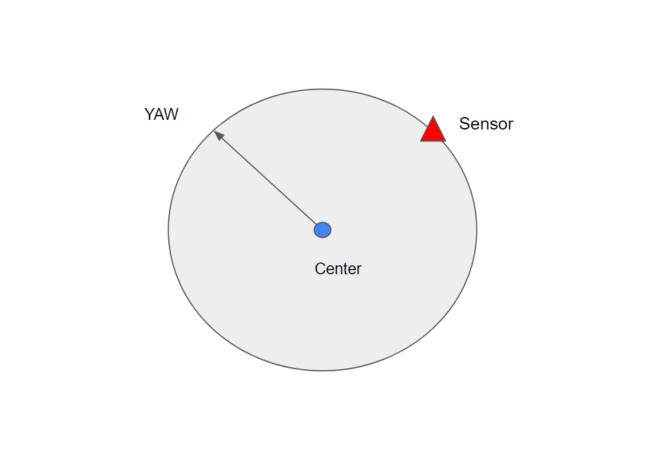

# tensorflow_based_circle_fitting
Consider a moving turning disc with a sensor on its arc. This is a Tensorflow-based implementation for finding the transformation from sensor to the center. 

## The required data
To make this model work, first you have to provide a dataset of arcs, with (n,sample_points,3) shape. n is the number of records to train the model with, sample_points is the number of points sampled from the arcs, and 3 is for x,y, and a yaw estimation for a point on the shape

